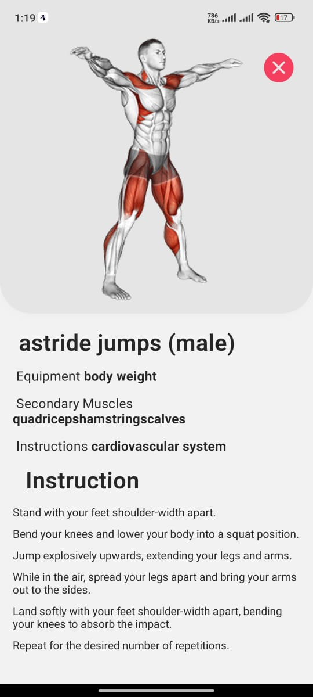

# Reactnative-app-gym-exercise
gym app build in reactnative expo with nativewind(tailwind for Reactnative) for designing
## Overview
This repository contains the source code for a Gym Exercise app built using React Native. The app provides users with various exercise plans and instructions tailored for gym workouts. It leverages React Native Expo for development and integrates with free API services and external content providers for data retrieval and presentation.

## Tools Used
1. **React Native Expo**: A framework for building cross-platform mobile applications with React.
2. **Free API Service**: *(Specify the service/provider here)*
3. **NativeWind**: A UI library for React Native that provides pre-styled components for faster UI development.
4. **Rapid API**: A platform that enables developers to access and integrate external APIs into their applications seamlessly.

## Features
- View different workout plans for various days.
- Access detailed instructions for each exercise, including information on sets and repetitions.
- *(Add any additional features here)*

## Screenshots

  
  
  

